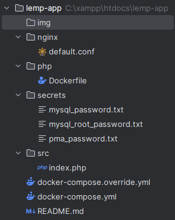
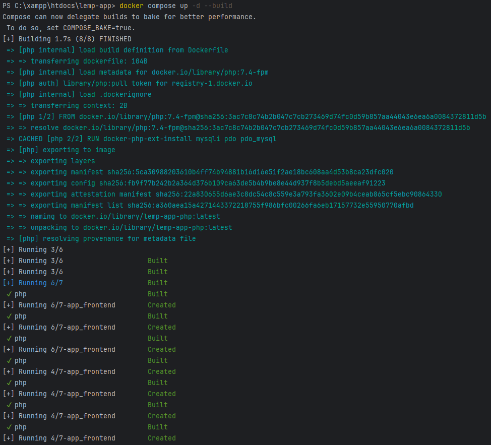
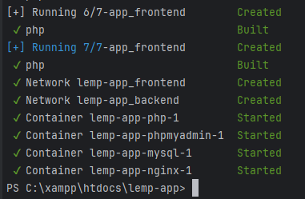
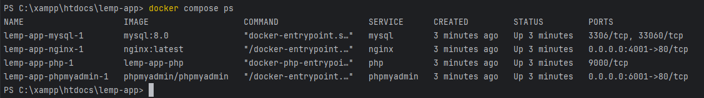
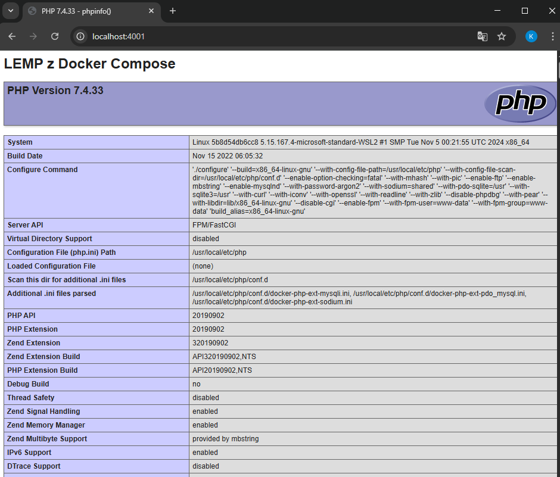
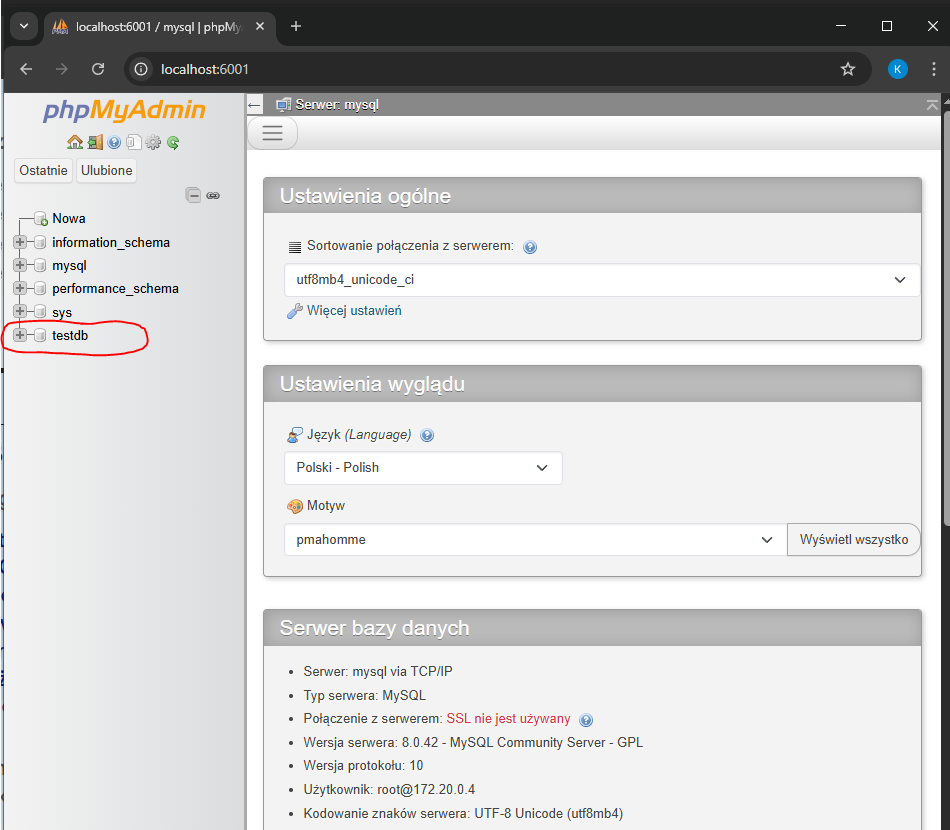

# SPRAWOZDANIE z zadania 12 oraz zadania 13 i 14.
### Do realizacji zadania 12 zbudowano plik docker-compose.yml który pozwolił na uruchomienie stacka LEMP wraz z phpMyAdmin.
### Struktura projektu:


W katalogu php dodany został plik Dockerfile pozwalający zbudować obraz PHP-FPM ze wsparciem dla MySQL 
 
W katalogu nginx dodany został plik default.conf który  powoduje, że zapytania .php przekierowywane są do usługi php na porcie 9000 

Plik index.php w katalogu src wyświetla stronę PHP z informacjami o konfiguracji.

### Wszystkie dane wrażliwe wykorzystywane przez aplikacje LEMP skonfigurowane zostały jako secrets (umieszczone w katalogu secrets).
### Plik docker-compose podzielony został na plik bazowy (docker-compose.yml) oraz override (docker-compose.override.yml). Plik bazowy definiuje składniki aplikacji, które są takie same w różnych środowiskach. W pliku override dodane zostały opisy ustawień aplikacji dla danego środowiska uruchomieniowego.

### W docker-compose.yml zdefiniowane są 4 miktousługi:

### 1. nginx

```shell 
  nginx:
    image: nginx:latest
    volumes:
      - ./src:/var/www/html
      - ./nginx/default.conf:/etc/nginx/conf.d/default.conf:ro
    networks:
      - frontend
      - backend
    depends_on:
      - php
      - mysql
```
Wykorzystuje obraz zdefiniowany tagiem latest, wykorzystuje default.conf do montowania katalogu z index.php do /var/www/html. Przyłączony jest do sieci backend oraz frontend.


### 2. php

```shell 
  php:
    build: ./php
    networks:
      - backend
    volumes:
      - ./src:/var/www/html
```
Do budowania obrazu Docker użyje Dockerfile (z katalogu ./php). Podłączony jest do sieci backend i mapuje lokalny katalog src do /var/www/html w kontenerze. 

### 3. mysql

```shell 
  mysql:
    image: mysql:8.0

    volumes:
      - db_data:/var/lib/mysql
    networks:
      - backend
```
Wykorzystuje obraz mysql w wersji 8.0. Wolumen db_data mapowany do katalogu z danymi MySQL. Przyłączony do sieci backend.

### 4. phpmyadmin

```shell 
  phpmyadmin:
    image: phpmyadmin/phpmyadmin
    networks:
      - frontend
      - backend
```
Wykorzystuje oficjalny obraz phpMyAdmin. Podłączony został do sieci frontend oraz backend, ponieważ frontend pozwala uzyskać dostęp z zewnątrz, np. przez przeglądarkę, sieć backend umożliwia komunikację z bazą MySQL.


### Plik docker-compose.override.yml zawiera tylko te fragmenty konfiguracji, które różnią się od wersji bazowej, wprowadza mechanizm secrets oraz definiuje wystawione porty (nginx - 4001, phpMyAdmin - 6001).

### Weryfikacja działania:
1. Zbudowanie i uruchamianie:
```shell 
  docker compose up -d --build
```



2. Sprawdzenie statusu kontenerów:
```shell 
  docker compose ps
```


3. Wyświetlanie index.php na porcie 4001:
   


4. Wyświetlanie phpMyAdmin na porcie 6001:
   